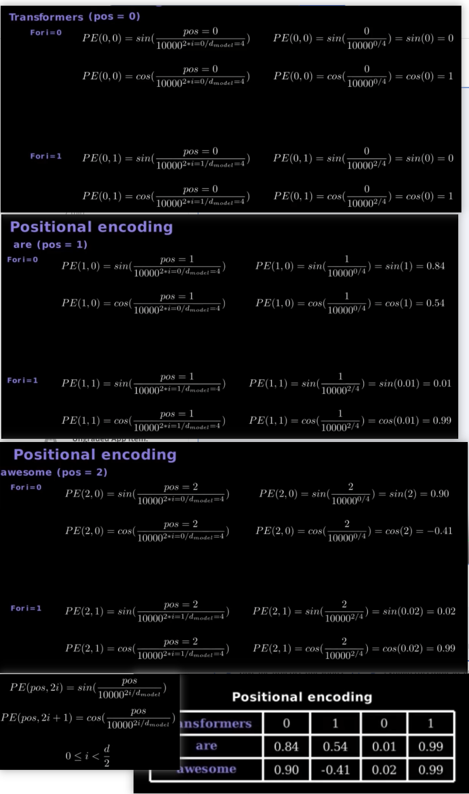

# BackGround

The Transformer model is essentially a fully connected self-attention mechanism that has no built-in sequence awareness when processing input data. To let the model know the relative order of the elements in the sequence, positional coding is introduced.

Positional Encoding is a technique used in serial models (especially in Transformer models) to represent positional information relative or absolute between positions in input data.

# Positional Encoding implementation

Position coding in the Transformer model typically uses **sine and cosine** functions

- Encoding for even dimensions uses the sine function
- Encoding for odd dimensions uses the cosine function



# The nature of Positional Encoding
- **same dimensions**: positional encoding has the same dimensions as the input word vector, so that it can be added directly. 
- **Sensitive to position differences**: Because sine and cosine functions are used in the coding, the encoding differences at different positions gradually change with distance, so the model can capture the relative relationship between the positions.

# Addition of Embeddings
The combination of these three embeddings—input embedding, positional encoding, and segment embedding—gives the model a rich representation of each word, including its meaning, position, and sentence context.

- What the word is (input embedding),
- Where it is in the sequence (positional encoding),
- Which segment it belongs to (segment embedding, if applicable).

# Positional Encoding in Pytorch
```python
VOCAB_SIZE = len(vocab)
EMBEDDING_DIM = 10
embedding = nn.Embedding(VOCAB_SIZE, EMBEDDING_DIM)
# Gets the embeddings of three words in the vocabulary with indexes 5, 200, and 999.
token_indexes = [5, 200, 999]
# Returns a tensor of shape (3, 10) representing the 10-dimensional embedding vector corresponding to the three words.
my_embeddings = embedding(token_indexes)
```
- torch.arange(0, emb_size, 2)

When emb_size = 10, the resulting sequence is [0, 2, 4, 6, 8]
- math.log(10000)

Transformer is a constant used in the paper that controls the rate of change of position coding in different dimensions. It can be understood as a scale factor that makes the encoding frequency of different dimensions different.
- torch.exp(...)

The result is attenuation factors of different dimensions, which are combined with the position index to calculate the sin and cos functions.

- reshape(maxlen, 1)

Turn the original one-dimensional tensor into a column vector

- pos_embedding = torch.zeros((maxlen, emb_size))

An all-zero matrix of shape (maxlen, emb_size) is created

- pos_embedding[:, 0::2] = torch.sin(pos * den)

Even dimensions embedded for positions (0, 2, 4,...) Assign a sine value.

- pos_embedding[:, 1::2] = torch.cos(pos * den)

Odd dimensions embedded for positions (1, 3, 5,...) Assign the cosine

- pos_embedding = pos_embedding.unsqueeze(-2)

adds a new dimension at the specified position (dim). The -2 argument means "add a new dimension before the last dimension."

example:
```python
# before unsqueeze(-2):
Shape: (4, 3)
[
  [0.1, 0.2, 0.3],   # Position 0
  [0.4, 0.5, 0.6],   # Position 1
  [0.7, 0.8, 0.9],   # Position 2
  [1.0, 1.1, 1.2]    # Position 3
]
# After unsqueeze(-2):
Shape: (4, 1, 3)
[
  [[0.1, 0.2, 0.3]],  # Position 0
  [[0.4, 0.5, 0.6]],  # Position 1
  [[0.7, 0.8, 0.9]],  # Position 2
  [[1.0, 1.1, 1.2]]   # Position 3
]
```
- self.dropout = nn.Dropout(dropout)

prevent overfitting during training by randomly setting a fraction of input units to zero.

- self.register_buffer('pos_embedding', pos_embedding)

Register position embedding as a buffer

- 
```python
class PositionalEncoding(nn.Module):
    def __init__(self, emb_size, dropout, maxlen = 5000):
        super(PositionalEncoding, self).__init__()
        # Create a positional encoding matrix as per the Transformer paper's formula
        # The resulting den is a series of scaling factors for sine and cosine calculations, the size of which depends on the dimension of the word embeddings.
        den = torch.exp(- torch.arange(0, emb_size, 2) * math.log(10000) / emb_size)
        # generated an index of each position in the sequence (i.e., a location index).
        pos = torch.arange(0, maxlen).reshape(maxlen, 1)
        pos_embedding = torch.zeros((maxlen, emb_size))
        pos_embedding[:, 0::2] = torch.sin(pos * den)
        pos_embedding[:, 1::2] = torch.cos(pos * den)
        pos_embedding = pos_embedding.unsqueeze(-2)

        self.dropout = nn.Dropout(dropout)
        self.register_buffer('pos_embedding', pos_embedding)

    def forward(self, token_embedding: torch.Tensor):
        # Apply the positional encodings to the input token embeddings
        return self.dropout(token_embedding + \
                self.pos_embedding[:token_embedding.size(0), :])

encoded_tokens = positional_encoding(my_embeddings)
```