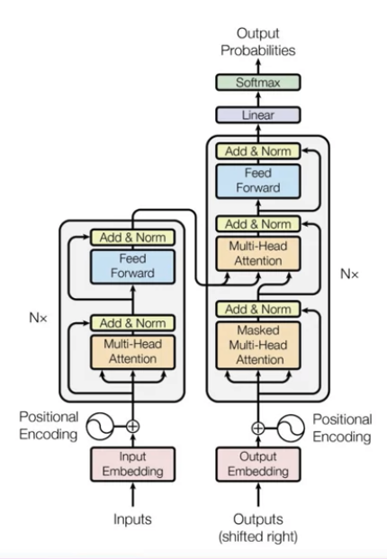
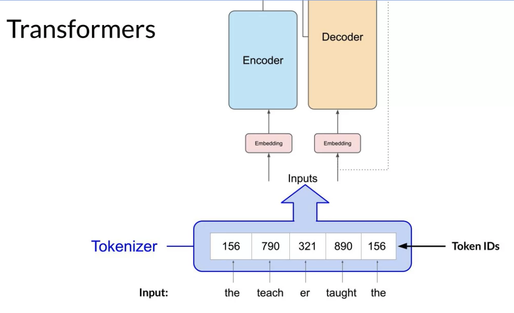
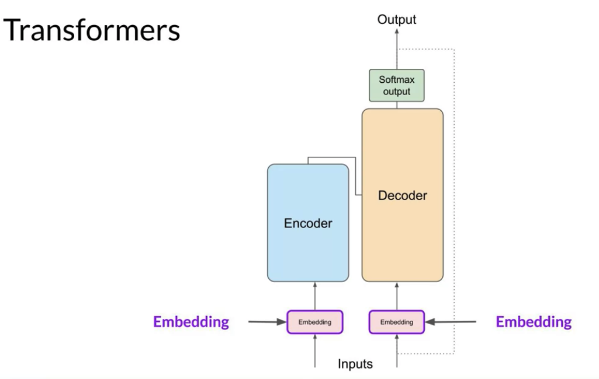
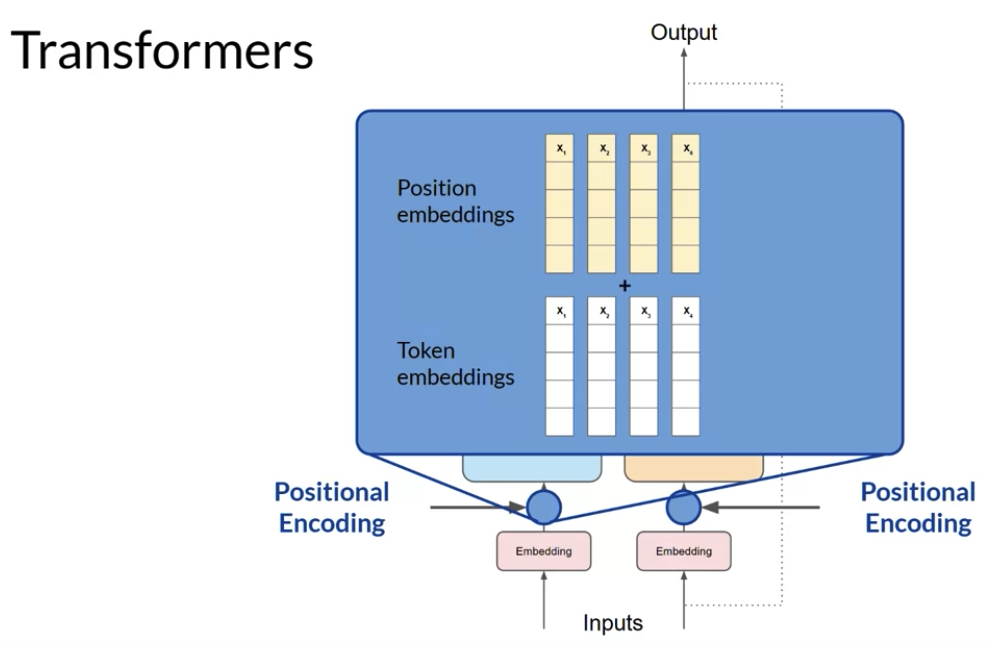
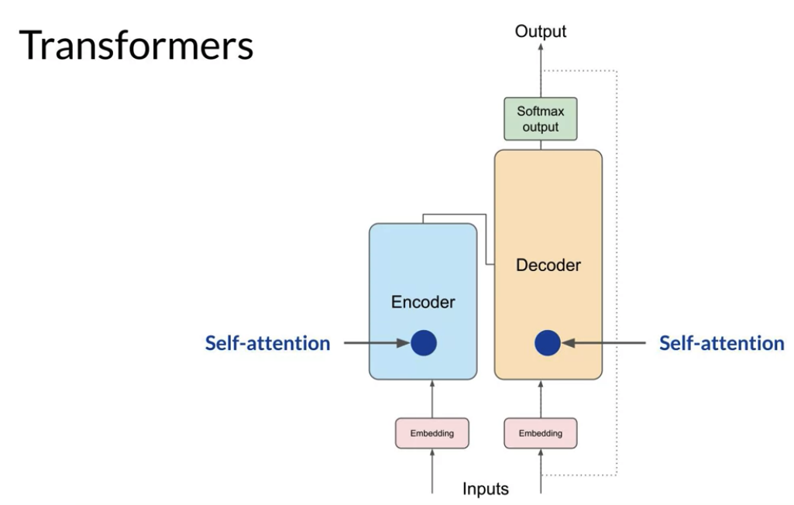
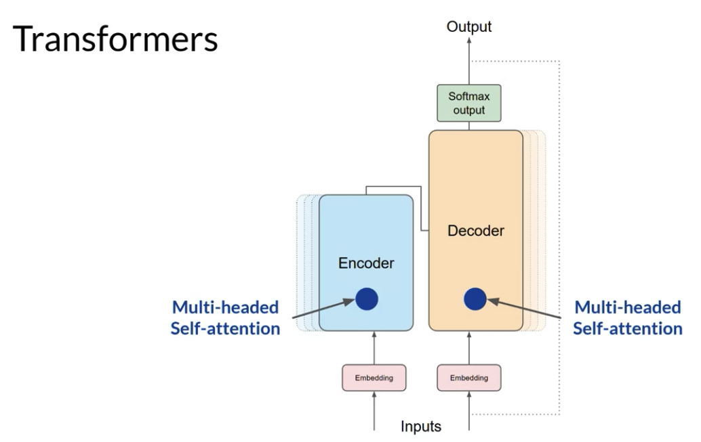
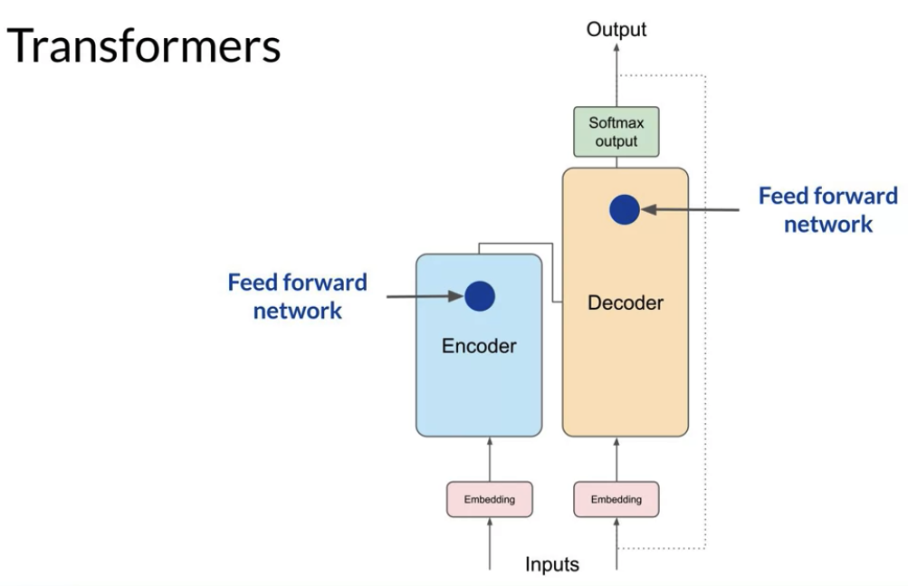
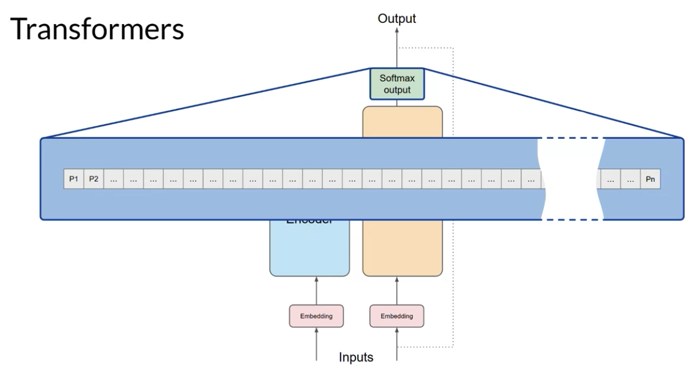

# Transformers Architecture

*Figure : Transformers Architecture*

*Figure : Tokenizer*

*Figure : Embedding*

*Figure : Positional Encoding*

*Figure : Self-attention*

*Figure : Multi-head Self-attention*

*Figure : Feed forward network*

*Figure : softmax output*

## Self-Attention

Self-attention is a fundamental mechanism used in neural networks, particularly in transformer architectures such as GPT. It enables the model to dynamically focus on different parts of an input sequence, enhancing its ability to generate or comprehend that sequence.

### Why Self-Attention is Powerful

1. **Capturing Long-Range Dependencies**  
   Self-attention allows the model to attend to elements in a sequence regardless of their distance from one another. This makes it far more effective than traditional models like RNNs or LSTMs, which struggle with long-distance dependencies due to their sequential nature.

2. **Parallelization**  
   Unlike RNNs that process sequences one step at a time, self-attention can compute relationships for all tokens in parallel. This leads to significantly faster training and inference, as multiple elements in the sequence can be processed simultaneously.
   
   
