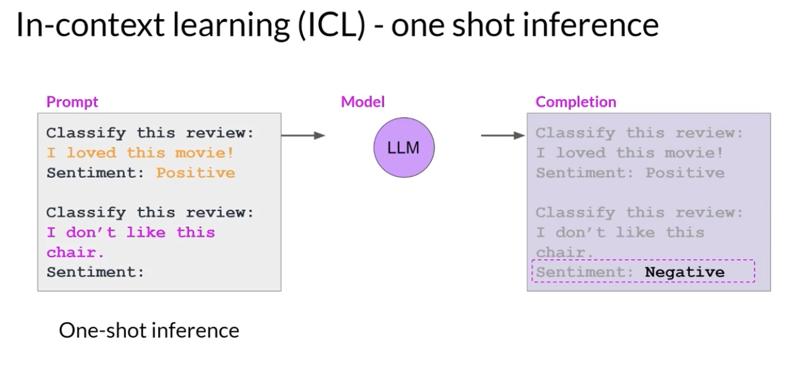
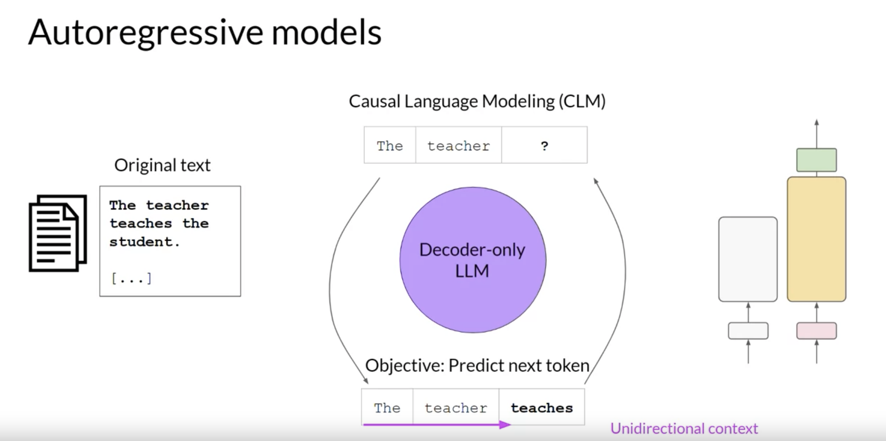
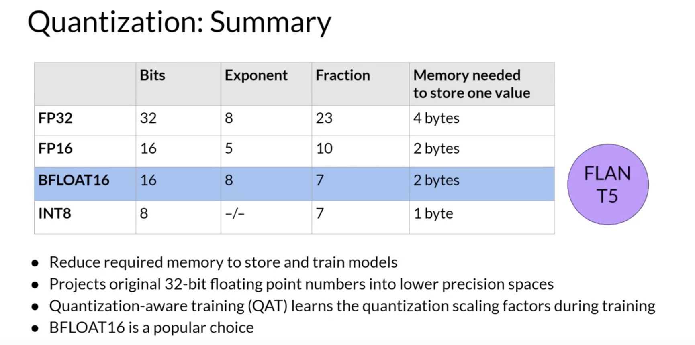

# Transformers Architecture

*Figure : Transformers Architecture*

*Figure : Tokenizer*

*Figure : Embedding*

*Figure : Positional Encoding*

*Figure : Self-attention*

*Figure : Multi-head Self-attention*

*Figure : Feed forward network*

*Figure : softmax output*

## Self-Attention

Self-attention is a fundamental mechanism used in neural networks, particularly in transformer architectures such as GPT. It enables the model to dynamically focus on different parts of an input sequence, enhancing its ability to generate or comprehend that sequence.

### Why Self-Attention is Powerful

1. **Capturing Long-Range Dependencies**  
   Self-attention allows the model to attend to elements in a sequence regardless of their distance from one another. This makes it far more effective than traditional models like RNNs or LSTMs, which struggle with long-distance dependencies due to their sequential nature.

2. **Parallelization**  
   Unlike RNNs that process sequences one step at a time, self-attention can compute relationships for all tokens in parallel. This leads to significantly faster training and inference, as multiple elements in the sequence can be processed simultaneously.
   
# Generating Text with Transformers

The complete transformer architecture consists of an **encoder and decoder** components. The encoder encodes input sequences into a deep representation of the structure and meaning of the input. The decoder, working from input token triggers, uses the encoder's contextual understanding to generate new tokens. It does this in a loop until some stop condition has been reached. While the translation example you explored here used both the encoder and decoder parts of the transformer, you can split these components apart for variations of the architecture. 

**Encoder-only models** also work as sequence-to-sequence models, but without further modification, the input sequence and the output sequence are the same length. You can train encoder-only models to perform classification tasks such as **sentiment analysis**, **BERT** is an example of an encoder-only model.

**Encoder-decoder models**, as you've seen, perform well on **sequence-to-sequence tasks such as translation**, where the input sequence and the output sequence can be different lengths. You can also scale and train this type of model to perform **general text generation tasks**.

**Decoder-only models** are some of the most commonly used today. Popular decoder-only models include the GPT family of models, BLOOM, Jurassic, LLaMA, and many more. 

*Figure : Generating Text with Transformers*

*Figure : Different types of Transformers*

# Prompt Engineering
The text that you feed into the model is called the **prompt**, the act of generating text is known as **inference**, and the output text is known as the **completion**.

## In-context Learning (ICL)

*Figure : In-context Learning*
### Zero-shot inference
Zero-shot inference with no examples.

*Figure : Zero-shot*

### One-shot inference
The inclusion of a single example is known as one-shot inference.

*Figure : One-shot*

### Few-shot inference
Giving a single example to include multiple examples. This is known as few-shot inference.

*Figure : Few-shot*

# Generative Configuration

When working with language models, the output can be controlled by several parameters. These parameters determine how the model generates text, affecting both the creativity and relevance of the response. Below are explanations of the most common parameters:

## Max tokens
- **Definition**: This controls the **maximum number of tokens** (words, parts of words, or punctuation) that the model will generate in the response.
- **Example**: If `max tokens` is set to 50, the model will stop generating text after 50 tokens, even if the response is incomplete.
- **Use case**: Limit response length to prevent overly long outputs in chatbot interactions or summary tasks.

Most large language models by default will operate with so-called **greedy decoding**. This is the simplest form of next-word prediction, where the model will always choose the word with the **highest probability**. This method can work very well for short generation but is susceptible to repeated words or repeated sequences of words. 

**Random sampling** is the easiest way to introduce some variability. Instead of selecting the most probable word every time with random sampling, the model chooses an output word at random using the probability distribution to weight the selection. 

*Figure : Sampling*

## Top K
- **Definition**: Top K sampling means the model selects from the **top K most probable tokens** at each step during text generation.
- **Example**: If `K = 50`, the model will randomly choose the next word from the top 50 highest probability tokens. Higher values of K lead to more diverse output.
- **Use case**: Set `K` to a lower value to generate more predictable responses, or set it higher to encourage more diversity and creativity.

## Top P (Nucleus Sampling)
- **Definition**: Instead of limiting the number of possible tokens, **Top P sampling** (also called **nucleus sampling**) selects tokens from the smallest set whose probabilities sum to a value **P** (a threshold between 0 and 1).
- **Example**: If `P = 0.9`, the model considers only the tokens whose combined probability mass is 90%. This allows the model to dynamically decide how many tokens to consider at each step.
- **Use case**: Top P sampling can be more flexible than Top K, allowing for greater diversity while keeping coherence. Lower values of `P` restrict creativity, while higher values introduce more randomness.

## Temperature
- **Definition**: **Temperature** controls the **randomness** of predictions by scaling the probabilities of the tokens. Lower values make the model more confident in choosing the most likely tokens, while higher values make the model more random and creative.
- **Example**: 
  - If `temperature = 0.1`, the model will choose the most likely tokens and the output will be very deterministic.
  - If `temperature = 1.0`, the model will choose tokens based on their original probabilities, resulting in balanced behavior.
  - If `temperature = 1.5`, the model will choose more diverse and random tokens, leading to more creative, but potentially less coherent, responses.
- **Use case**: Use low temperatures for factual and precise tasks, and higher temperatures for creative writing or brainstorming.

# Generative AI project lifecycle

*Figure : Generative AI project lifecycle*

## Scope

*Figure : Scope*

## Select
Your first choice will be to either work with an existing model (Pretrained LLM), or train your own from scratch(fine-tune). 

LLMs encode a deep statistical representation of language. This understanding is developed during the models pre-training phase when the model learns from vast amounts of unstructured textual data. During pre-training, the model weights get updated to **minimize the loss of the training objective**. The encoder generates an embedding or vector representation for each token. Pre-training also requires a **large amount of compute and the use of GPUs**. Note, when you scrape training data from public sites such as the Internet, you often need to process the data to **increase quality, address bias, and remove other harmful content**. As a result of this data quality curation, often only 1-3% of tokens are used for pre-training. You should consider this when you estimate how much data you need to collect if you decide to pre-train your own model.

*Figure : Pre-training*

### Encoder-only models (Autoencoding models)
Encoder-only models are also known as **Autoencoding models**, and they are pre-trained using **masked language modeling**. Here, tokens in the input sequence or randomly mask, and the training objective is to predict the **mask tokens** in order to reconstruct the original sentence. This is also called a denoising objective. 

*Figure : Autoencoding models*

#### Good use cases: 
 
 - **sentiment analysis** 
 
 - **named entity recognition** 
 
 - **word classification**.
 
 #### Example Model: 
 - **BERT**
 - **RoBERTA**
 
 ### Decoder-only (Autoregressive models)
They are pre-trained using **causal language modeling**. Here, the training objective is to **predict the next token** based on the previous sequence of tokens. Decoder-based autoregressive models, mask the input sequence and can only see the input tokens leading up to the token in question. The model has no knowledge of the end of the sentence. The model then iterates over the input sequence one by one to predict the following token. This means that the context is unidirectional. Models of this type make use of the decoder component off the original architecture without the encoder. 

*Figure : Autoregressive models*

#### Good use cases: 
 
 - **text generation** 
 
 - **Other emergent behavior** 
 
 #### Example Model: 
 - **GPT**
 - **BLOOM**
 
 ### Sequence-to-sequence model
The exact details of the pre-training objective vary from model to model. A popular sequence-to-sequence model **T5**, pre-trains the **encoder** using **span corruption**, which masks random sequences of input tokens. Those mass sequences are then replaced with a **unique Sentinel token**, shown here as x. Sentinel tokens are special tokens added to the vocabulary, but do not correspond to any actual word from the input text. The **decoder** is then tasked with reconstructing the mask token sequences auto-regressively. The output is the Sentinel token followed by the predicted tokens.

*Figure : Sequence-to-sequence*

#### Good use cases: 
 
 - **Translation** 
 
 - **Text summarization** 
 
 - **Question answering** 
 
 #### Example Model: 
 - **T5**
 - **BART**
 
 # Computational challenges
 CUDA, short for Compute Unified Device Architecture, is a collection of libraries and tools developed for Nvidia GPUs. Libraries such as PyTorch and TensorFlow use CUDA to boost performance on metrics multiplication and other operations common to deep learning. One technique that you can use to reduce the memory is called **quantization**. The main idea here is that you reduce the memory required to store the weights of your model by reducing their precision from 32-bit floating point numbers to 16-bit floating point numbers, or eight-bit integer numbers. 
 
 The corresponding data types used in deep learning frameworks and libraries are FP32 for 32-bit full position, FP16, or Bfloat16 for 16-bit half precision, and int8 eight-bit integers. The range of numbers you can represent with FP32 goes from approximately -3*10^38 to 3*10^38. By default, model weights, activations, and other model parameters are stored in **FP32**.
 
 

*Figure : quantization*

 

*Figure : Bfloat16*

*Figure : Summary*

# Efficient multi-GPU compute strategies
## distributed data-parallel

*Figure : Distributed Data Darallel*
## fully sharded data parallel(FSDP)

*Figure : fully sharded data parallel*
A popular implementation of modal sharding is PyTorch is fully sharded data parallel, or FSDP for short.