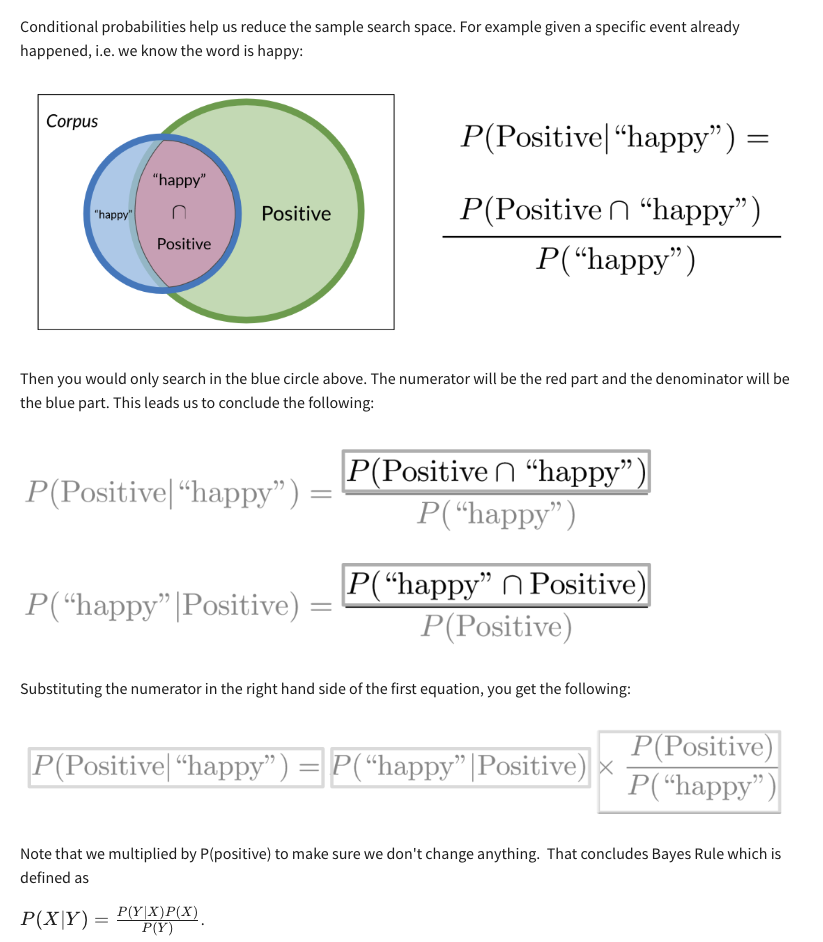

# Bayes Rule Overview and Probability Basics

## Key Points:
1. **Bayes Rule Introduction**:
   - Widely used in NLP for tasks like sentiment analysis and auto-correction.
   - Derived from the definition of conditional probabilities.

2. **Main Topics**:
   - Basics of probability and conditional probability.
   - Theory and practical applications of Bayes Rule.

3. **Applications**:
   - Sentiment analysis in NLP.
   - Auto-correction implementation in later courses.

4. **Highlights**:
   - Understand fundamental probability principles.
   - Learn to derive and apply Bayes Rule.

# Naive Bayes Introduction

# Laplacian Smoothing
By adding V (the number of unique words in the vocabulary) to the denominator and adding 1 to the numerator, the result will never be zero, as illustrated in the diagram.

# Log Likelihood

