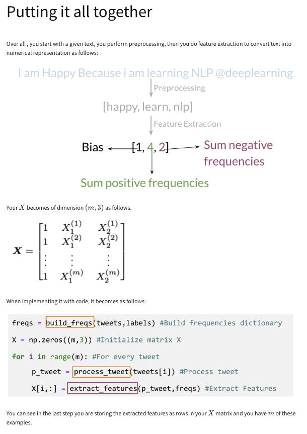
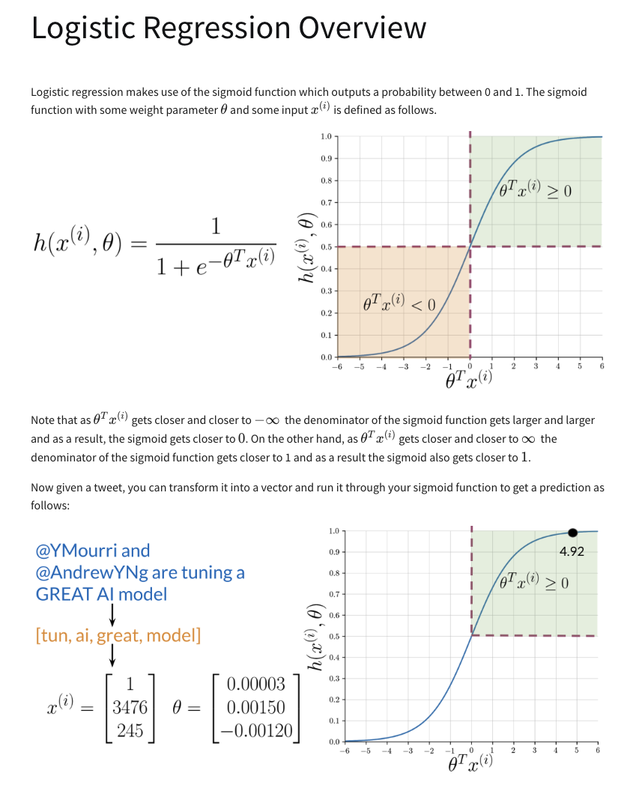
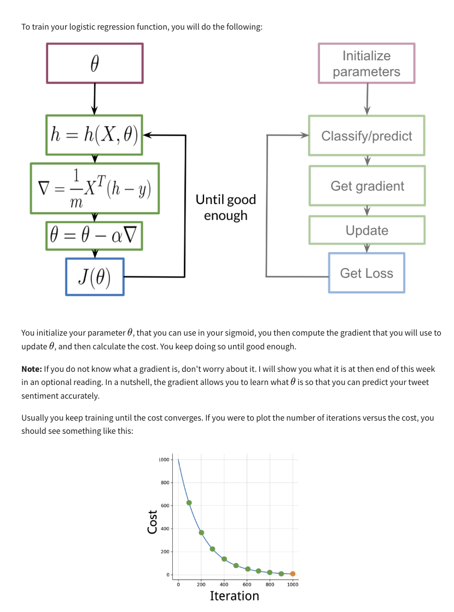
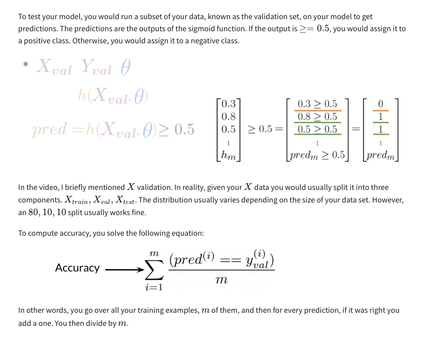
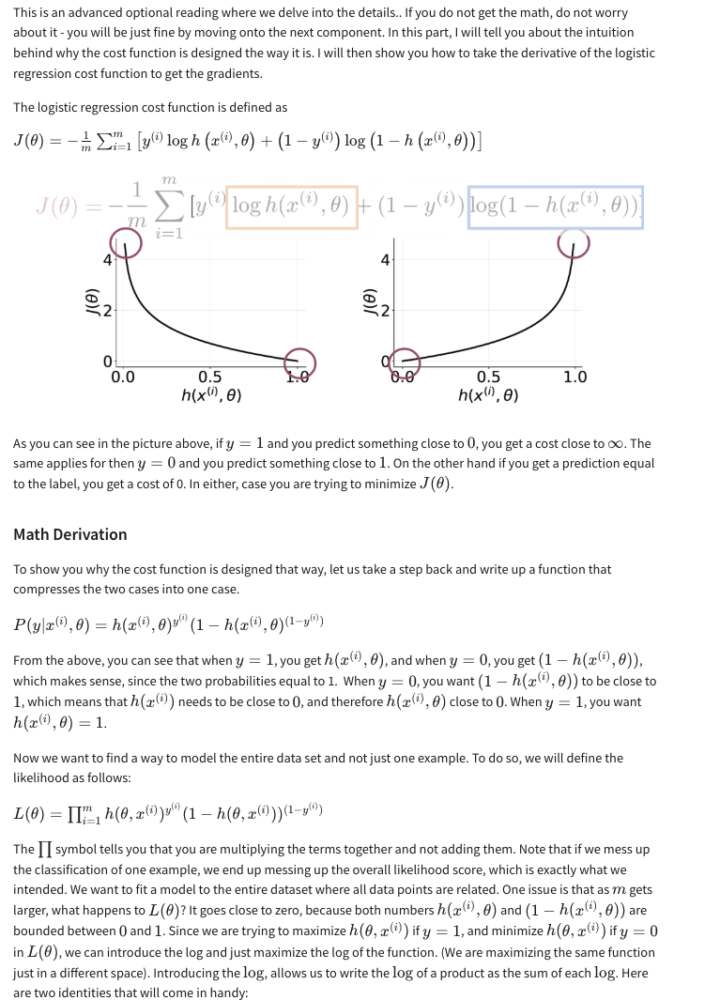
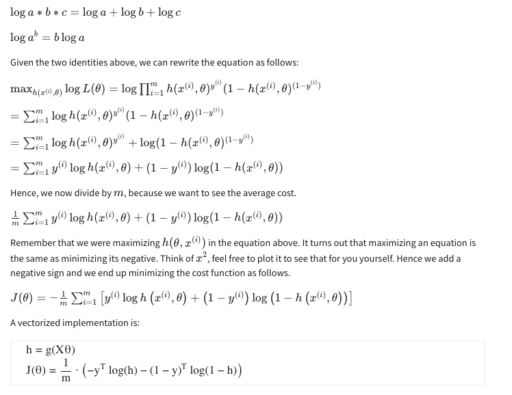

# Supervised Machine Learning and Logistic Regression

## Key Concepts
- **Goal**: Minimize the difference between actual labels (Y) and predictions (Ŷ) using a **cost function**.
- **Steps**:
  1. Run the prediction function.
  2. Minimize the cost by updating parameters iteratively.

## Sentiment Analysis Task
- **Example**: Predict if a tweet like *"I'm happy because I'm learning NLP"* is positive (1) or negative (0).
- **Classifier**: Logistic regression maps tweets to one of two classes.

## Steps to Build the Classifier
1. **Feature Extraction**: Process raw tweets to extract useful features.
2. **Model Training**: Train the logistic regression model to minimize cost.
3. **Prediction**: Classify tweets using the trained model.

# Text Representation as Vectors

## Key Concepts
- **Objective**: Encode text (e.g., tweets) as a numerical vector using a vocabulary.
- **Vocabulary (V)**: A list of unique words from all tweets.
  - Built by iterating through tweets and saving each unique word.
  - Example: "I am happy because I am learning" → Vocabulary: {I, am, happy, because, learning}.

## Feature Extraction
- For each word in the vocabulary:
  - **1** if the word appears in the tweet.
  - **0** if it does not appear.
- Result: A vector with **1s** for words present and **0s** for words absent.
  - Example: A tweet may have many **0s** and few **1s**, forming a **sparse representation**.

## Sparse Representation
- **Sparse Representation**:
  - High dimensionality with many zeros.
  - Features = Vocabulary size (**V**).
- **Challenges**:
  - Logistic regression must learn **V + 1 parameters**.
  - Large vocabularies lead to:
    - Long training times.
    - Slower predictions.

# Generating Word Counts for Logistic Regression

## Key Concepts
- **Objective**: Track word frequencies for positive and negative classes to extract features for logistic regression.
- **Frequency Dictionary**: A mapping from a word and its class (positive or negative) to the number of times it appears in that class.

## Steps to Generate Counts
1. **Define Vocabulary**:
   - Build a vocabulary of unique words from your corpus (e.g., 8 unique words in 4 tweets).
2. **Separate Tweets by Class**:
   - Divide tweets into **positive** and **negative** classes.
3. **Count Word Frequencies**:
   - For each word in the vocabulary, count occurrences in positive and negative tweets.
     - Example: 
       - "happy" appears **2 times** in positive tweets → Positive frequency = 2.
       - "am" appears **3 times** in negative tweets → Negative frequency = 3.

## Frequency Dictionary
- **Structure**: `{(word, class): frequency}`
  - Example:
    - `("happy", positive): 2`
    - `("am", negative): 3`
- **Purpose**: Used to extract features for logistic regression based on word occurrences in each class.

# Optimized Tweet Representation (Dimension 3)

## Key Concepts
- **Goal**: Reduce tweet representation from dimension **V** to dimension **3** for faster logistic regression.
- **Benefits**: 
  - Faster training and prediction.
  - Logistic regression only needs to learn 3 features instead of V.

## Features for Dimension 3 Representation
1. **Bias Unit**: A constant value of 1.
2. **Sum of Positive Frequencies**: Total frequency of words from the tweet in the positive class.
3. **Sum of Negative Frequencies**: Total frequency of words from the tweet in the negative class.

## Steps to Extract Features
1. **Prepare Frequency Dictionary**:
   - Map word-class pairs to their frequencies.
2. **Feature Extraction**:
   - **Second Feature**: Sum positive frequencies of words from the tweet.
   - **Third Feature**: Sum negative frequencies of words from the tweet.
   - Example:
     - For a tweet:
       - Sum of positive frequencies = 8.
       - Sum of negative frequencies = 11.
     - Resulting vector = `[1, 8, 11]`.

# Text Preprocessing: Stemming and Stop Words

## Key Steps
1. **Remove Stop Words and Punctuation**  
   - Eliminate common words (e.g., *and, are*) and punctuation.  
   - Remove handles (`@user`) and URLs.

2. **Stemming**  
   - Reduce words to their base form.  
     - Example: `tune`, `tuned`, `tuning` → `tun`

3. **Lowercasing**  
   - Convert all words to lowercase.  
     - Example: `GREAT`, `Great`, `great` → `great`

## Final Output
- Processed Tweet → `['tun', 'great', 'ai', 'model']`

# Building the Feature Matrix (X)

## Steps
1. **Preprocess Tweets**  
   - Remove stop words, URLs, handles, punctuation.  
   - Apply stemming and lowercase words.

2. **Extract Features**  
   - Use a frequency dictionary:  
     - **Bias**: 1  
     - **Positive Frequency Sum**  
     - **Negative Frequency Sum**

3. **Build X Matrix**  
   - Rows = Tweets (m tweets).  
   - Columns = `[1, Positive Sum, Negative Sum]`.

## Example
| Bias | Positive Sum | Negative Sum |
|------|--------------|--------------|
| 1    | 8            | 11           |
| 1    | 5            | 7            |

**Next**: Use `X` matrix in logistic regression.

# Logistic Regression Overview

## What is Logistic Regression?  
Logistic regression is a method to predict if a tweet has **positive** or **negative** sentiment using extracted features.

## Key Points  
1. **Sigmoid Function**:  
   - Outputs a probability between **0** and **1**.  
   - If the result ≥ 0.5 → Positive sentiment.  
   - If the result < 0.5 → Negative sentiment.  

2. **How it Works**:  
   - **Input**: Features (e.g., word frequencies).  
   - **Output**: Prediction (Positive or Negative).  
   - The function depends on:  
     - Parameters \( \Theta \) (weights).  
     - Feature vector \( X \) (tweet features).  

3. **Example in Sentiment Analysis**:  
   - Tweets are preprocessed: remove handles, lowercase words, and reduce to stems.  
   - Features (e.g., counts of positive and negative words) are extracted.  
   - Using optimized parameters, the sigmoid function predicts the sentiment.  
 

## Training Logistic Regression Classifier

### Objective  
Learn how to find the optimal **theta** (parameters) from scratch to train a logistic regression model using **gradient descent**.

### Key Steps in Training  

1. **Initialize Parameters**:  
   - Start with an initial set of parameters \( \theta \) (e.g., all zeros).

2. **Use the Logistic Function**:  
   - Apply the **sigmoid function** to compute predictions for each observation.

3. **Compute Gradients**:  
   - Calculate the **gradient of the cost function** to determine the direction to update \( \theta \).  

4. **Update Parameters**:  
   - Adjust \( \theta \) iteratively in the direction of the gradient.

5. **Evaluate Cost**:  
   - Compute the cost \( J \) after each iteration to check if the training is improving.  

6. **Stop Condition**:  
   - Training stops when:  
     - A predefined number of iterations is reached.  
     - The cost function converges to a minimum.

### Gradient Descent Algorithm  
- Gradient descent **minimizes the cost function** by iteratively updating \( \theta \).  
- Over time, the cost function decreases, as shown in the contour plots (left) and its evolution over iterations (right).

### Evaluating Your Classifier  
- Once you have the final \( \theta \), you plug it into the **sigmoid function** to predict outputs.  
- Evaluate whether your classifier performs well or poorly.  

# Evaluating the Logistic Regression Model

## Overview  
This step focuses on evaluating how well the trained logistic regression model performs on unseen data using the **validation set**.

## Key Steps  

1. **Validation Data**:  
   Use the validation set (**X_val** and **Y_val**) that was set aside during training.  

2. **Make Predictions**:  
   - Use the trained parameters (**Theta**) to compute predictions.  
   - Compare each prediction to a threshold (e.g., 0.5):  
     - If the value is ≥ 0.5, predict **Positive**.  
     - Otherwise, predict **Negative**.

3. **Compare Predictions to True Labels**:  
   - Check if each prediction matches the true label:  
     - Correct prediction → 1  
     - Incorrect prediction → 0  

4. **Calculate Accuracy**:  
   - Accuracy = Proportion of correct predictions over the total number of observations.  

## Example  
For 5 predictions:  
- Compare predictions to true labels.  
- Count the correct predictions.  
- Divide by the total number of examples to get the accuracy (e.g., 80%).

# Logistic Regression: Cost Function

