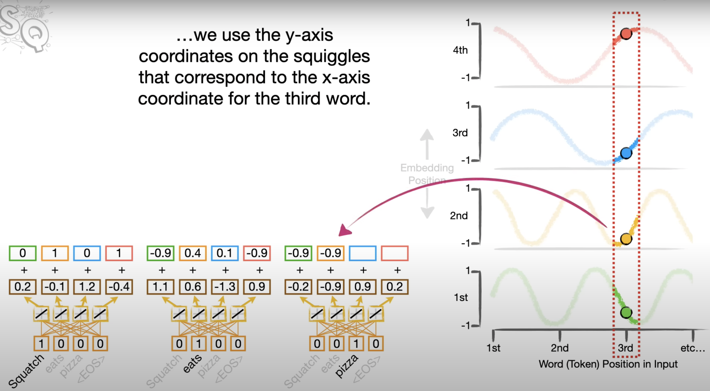
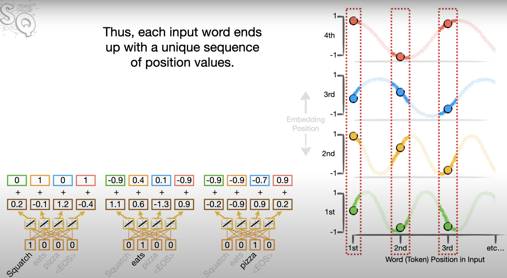
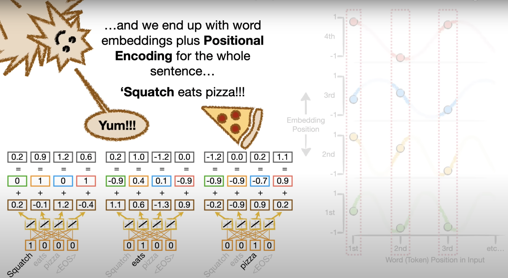

# What is Positional Encoding?
* Positional Encoding is a technique used by Transformers to keep track of the **order** of words in a sentence. Since Transformers process words in parallel (instead of sequentially like RNNs), they need a way to understand the relative positions of words.
* It encodes information about the position of each word in the sentence into the word's embedding.
 
 

*Figure : position_encoding*

# Sine and Cosine Waves:
* Positional encoding is added to these word embeddings to introduce information about the word’s position in the sentence. The encoding values come from alternating sine and cosine waves.
* Each wave represents a different dimension of the position encoding, and the amplitude (height) of the wave provides a unique encoding for each word's position in the sentence.
* The waves are used to assign values to different dimensions of the embedding for each word based on its position.

* The higher the dimension of the embedding, the wider the squiggles get. This means the positional encoding for higher dimensions changes more slowly compared to lower dimensions.
The idea is that different positions in the sequence get unique values from these squiggles, allowing the model to differentiate between the words' positions.
 

*Figure : unique_position*

 

*Figure : word embeddings plus positional encoding for the whole sentence*

