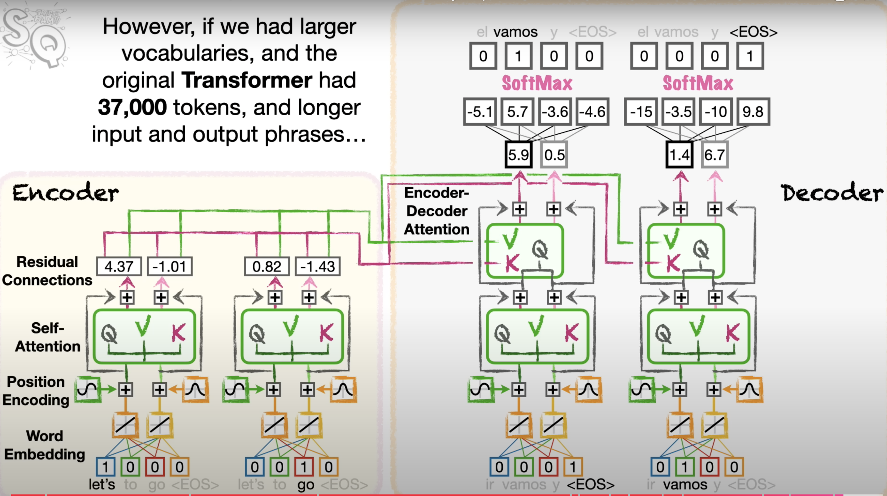

# Encoder
 

*Figure : encoder*

 

*Figure : SELF ATTENTION*

## How Query, Key, and Value Vectors Are Obtained in Transformer

In the **Transformer** model, the **Query**, **Key**, and **Value** vectors are obtained through linear transformations applied to the input word embeddings. Here’s how it works step-by-step:

### 1. Word Embedding
- Each input word is first converted into a fixed-dimension vector using an embedding layer. This vector represents the word's semantic meaning.
- For example, the sentence "Let's go" would have word embeddings for "Let's" and "go," where each word is represented by a numerical vector.

### 2. Linear Transformations
- To generate **Query**, **Key**, and **Value** vectors, the word embeddings are passed through separate linear transformations.
- These transformations are achieved by multiplying the word embeddings by different weight matrices:
  - **Query vector**: 
    \[
    \text{Query} = W_Q \times \text{Embedding}
    \]
  - **Key vector**: 
    \[
    \text{Key} = W_K \times \text{Embedding}
    \]
  - **Value vector**: 
    \[
    \text{Value} = W_V \times \text{Embedding}
    \]
- \( W_Q \), \( W_K \), and \( W_V \) are learnable weight matrices (parameters) that are optimized during the training process.

### 3. Explanation of Parameters
- **Embedding**: The word embedding vector for each word (e.g., "Let's" might be represented by the vector `[1.87, 0.09, -0.78, 0.27]`).
- **Weight Matrices \( W_Q, W_K, W_V \)**: These are different matrices used to transform the embedding into the Query, Key, and Value vectors. They are learned during training.
  - \( W_Q \) generates the Query vector, which is used to ask how relevant a word is to others.
  - \( W_K \) generates the Key vector, which is compared with the Query to determine how similar two words are.
  - \( W_V \) generates the Value vector, which contains the word’s main information that will be used in the attention calculation.

### 4. How Query, Key, and Value Vectors Are Created
- Suppose the word "Let's" has the embedding `[1.87, 0.09, -0.78, 0.27]`. To generate the Query vector for "Let's", you multiply this embedding by the \( W_Q \) matrix. Similarly, multiplying the same embedding by \( W_K \) and \( W_V \) produces the Key and Value vectors for "Let's".
- The same process is repeated for all the words in the sentence.

### 5. Why Do We Need Query, Key, and Value?
- **Query** is used to "ask" about the importance of the current word with respect to the others (like, “Which words are most relevant to this word?”).
- **Key** is used to "answer" this question by being compared with the Query vectors of other words.
- **Value** holds the information we want to propagate forward. The final output is a weighted combination of these values based on the attention scores (calculated from the Query and Key).

### 6. Example Process
- After transforming the embeddings, "Let's" might have its Query, Key, and Value vectors.
- These vectors are then used to calculate how much attention "Let's" should pay to the other words (like "go"). This is done by multiplying Query vectors with Key vectors to compute attention scores. Based on these scores, the Value vectors are weighted and combined to produce the output for each word.

### Summary
- **Query**, **Key**, and **Value** vectors are generated by applying separate linear transformations (multiplying with learnable weight matrices \( W_Q, W_K, W_V \)) to the input word embeddings.
- These vectors are used in the self-attention mechanism to compute how much each word should "attend" to other words in the sentence.
- This process allows the Transformer to capture relationships between words, even if they are far apart in the sentence, by learning how relevant each word is to every other word.

 

*Figure : self_attention_algorithm*

 

*Figure : same weights OF self attention*

 

*Figure : stack of self attention*
## Multi-Head Attention in Transformers

In the **Transformer** model, we can create a **stack of Self-Attention cells**, each with its own set of **weights**. These weights are applied to the **Position Encoded** values for each word to capture various relationships between words.

### How Self-Attention Works:
- **Self-Attention** computes relationships between words in a sequence. It determines how much focus a word should have on other words in the sentence, allowing the model to understand the context.
- The model applies **Query**, **Key**, and **Value** operations on the position-encoded word vectors (word embeddings + positional encodings), which helps the model to learn the importance of one word in relation to others.

### Multi-Head Attention:
- Instead of using a single Self-Attention operation, **Transformers** use multiple self-attention layers (or **heads**), each with its own unique set of weights.
- This is called **Multi-Head Attention**, which allows the model to capture **different types of relationships** among the words in parallel.
- Each head processes the input with a different perspective, capturing various aspects of the sentence structure and meaning.
  
### Example:
- As shown in the image, multiple attention cells are stacked. The values produced by one attention head (e.g., 2.5, -2.1 for "Let’s") are different from those in another head (e.g., -1.68, 0.67 for "go").
- Each head provides a different interpretation of the relationships between the words, leading to a more robust understanding.

 

*Figure : Multi-Head Attention*

*Figure : four features of transformer*

*Figure : compute each features at same time*
## Parallel Processing in Transformers

- **Word Embeddings** can be calculated on different processors at the same time, allowing for efficient parallel processing.
- After calculating the embeddings, we can add **Positional Encoding** to the word embeddings simultaneously to encode word order.
- Once the embeddings are ready, we can calculate the **Queries**, **Keys**, and **Values** for all words at the same time.

This parallelization is one of the key innovations of the Transformer architecture, enabling it to handle long sequences more efficiently than traditional models like RNNs, which process input sequentially.

# Decoder
- **Transformers** use **Word Embedding** to convert words into numbers...
- **Positional Encoding** keeps track of word order...
- **Self-Attention** helps track the relationships within the input and output phrases...
- **Encoder-Decoder Attention** ensures that the Decoder keeps track of important words in the input during translation...
- **Residual Connections** allow sub-units, like Self-Attention, to focus on solving parts of the problem.

*Figure : decoder*

So, the main idea of **Encoder-Decoder Attention** is to allow the **Decoder** to keep track of the significant words in the input.

# Key Concepts from Transformers

- **Word Embeddings**: 
  - Transformers use word embeddings to convert words into numbers for efficient handling of text data.

- **Positional Encoding**:
  - Used by Transformers to keep track of word order. 
  - Positional encoding values are added to word embeddings to represent the position of each word in the sentence.

- **Self-Attention**:
  - Self-attention allows the model to focus on relevant words within the input and output phrases.
  - Helps the model track relationships between words in the same sentence.

- **Encoder-Decoder Attention**:
  - Ensures the decoder keeps track of important words in the input when generating output.
  - Tracks relationships **between** input and output sequences to make sure essential information isn’t lost.

- **Residual Connections**:
  - These allow sub-units like self-attention to focus on solving specific parts of a problem.
  - Residual connections also help in retaining information during the flow of data through the network.

- **Larger Vocabulary Handling**:
  - When using larger vocabularies (like 37,000 tokens in the original Transformer), normalization of values is required after every step to ensure the model works correctly.

- **Attention Calculation**:
  - Attention values can be calculated using a dot-product, which measures the similarity between words.
  - You can use different similarity functions, but dot-product is commonly used.

- **Weights and Biases**:
  - Additional neural network layers with weights and biases can be added to both the encoder and decoder to handle more complex data.
  - This provides flexibility and learning capacity to the model.

