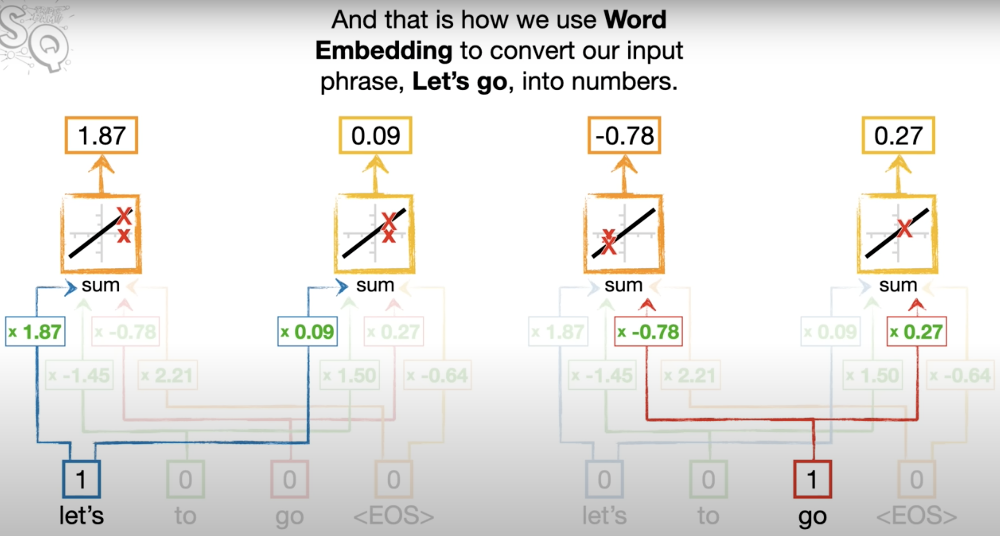
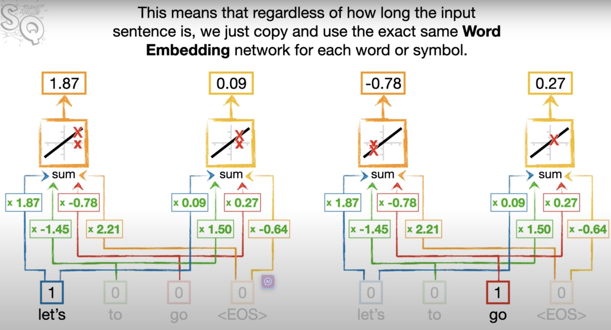
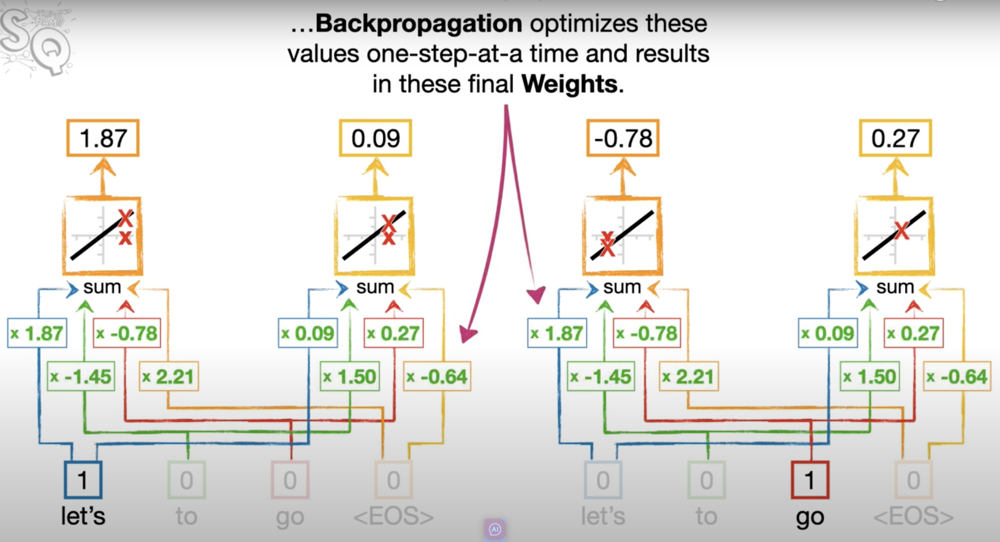
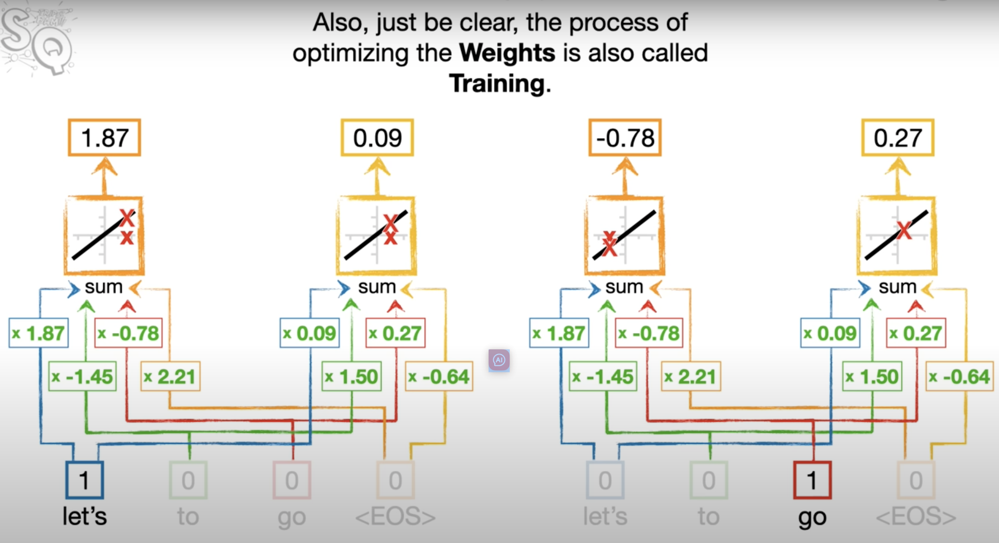

 **Word Embedding** converts each word or token into a vector of numbers that represents its semantic meaning.
 
 

*Figure : Word_Embedding*

Reusing the Embedding Layer: The same embedding process is applied for each word in a sentence, which allows the model to handle sentences of any length.

 

*Figure : Same_Word_Embedding*

 

*Figure : Backpropagation*

 

*Figure : training*